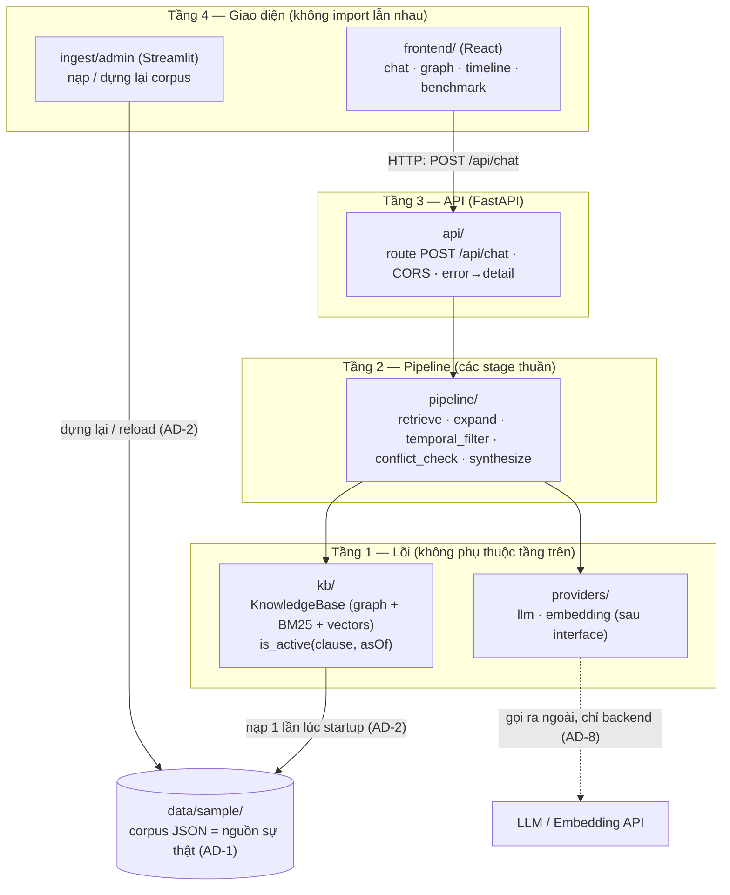
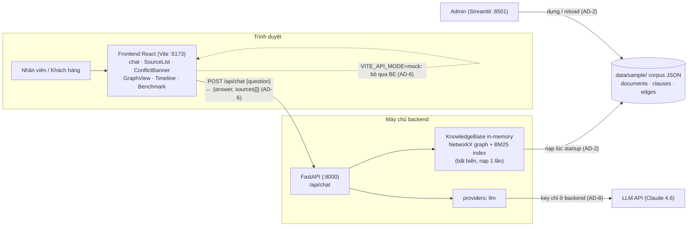
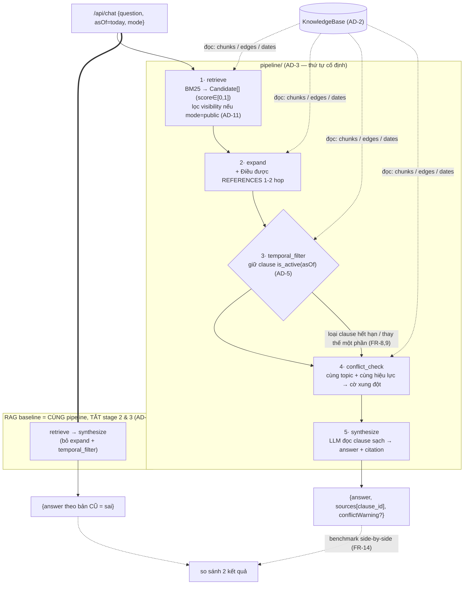
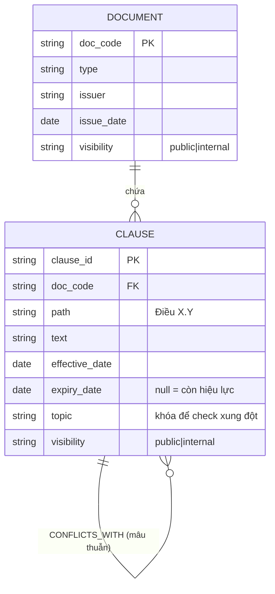

# Architecture Spine — Compliance Copilot

## Design Paradigm

**Một KnowledgeBase bất biến + pipeline truy vấn tuyến tính, trên nền backend phân tầng.**

- **Immutable KnowledgeBase:** toàn bộ tri thức (đồ thị + chỉ mục tìm kiếm) được dựng **một lần lúc khởi động** từ một corpus JSON, và **không đổi trong lúc phục vụ**. Mọi request chỉ đọc.
- **Pipes-and-filters:** mỗi câu hỏi đi qua chuỗi *stage* cố định, mỗi stage nhận và trả một kiểu dữ liệu rõ ràng. RAG baseline là *cùng pipeline* với vài stage tắt đi.
- **Layered backend:** `api → pipeline → knowledgebase`. Tầng dưới không bao giờ import tầng trên.

Ánh xạ tầng → thư mục: `api/` (HTTP), `pipeline/` (các stage), `kb/` (đồ thị + store + temporal), `providers/` (LLM/embedding), `ingest/` (dựng corpus).

## Invariants & Rules

### AD-1 — Corpus JSON là nguồn sự thật duy nhất
- **Binds:** all (Epic 1–7, BE + FE)
- **Prevents:** FE và BE dựng hai mô hình dữ liệu khác nhau; hai nơi cùng "sở hữu" đồ thị.
- **Rule:** Có **một** corpus JSON chuẩn `{documents[], clauses[], edges[]}` (hand-annotate). Backend (đồ thị + tìm kiếm) và Frontend (trực quan) đều nạp từ đó. Không component nào tự chế schema riêng. **Commit `data/sample/corpus.schema.json` thật** (không để trống); mọi `edges[].from`/`edges[].to` là `clause_id` (không phải doc_code); cạnh cấp văn bản dùng clause đại diện. `clause_id` do bước **annotate tay sinh ra** và là khóa duy nhất (ingest không tự sinh id mới).

### AD-2 — KnowledgeBase bất biến, nạp một lần
- **Binds:** backend (Epic 1–4, 6, 7)
- **Prevents:** tranh chấp trạng thái giữa các request; kết quả không nhất quán.
- **Rule:** Lúc startup, corpus được nạp vào một đối tượng `KnowledgeBase` bất biến (NetworkX graph + BM25 index). Request **không** sửa nó. Ingest văn bản mới (FR-3) và Radar (FR-16) = **dựng KB mới rồi atomic swap** con trỏ `current_kb`, KHÔNG mutate tại chỗ. Mỗi request **pin `current_kb` ngay lúc vào** và dùng snapshot đó tới hết — reload giữa chừng không ảnh hưởng request đang chạy.

### AD-3 — Truy vấn là pipeline stage cố định; baseline dùng chung pipeline
- **Binds:** Epic 2, 3, 4, 6 (FR-4,5,8,9,11,14,15)
- **Prevents:** các stage được viết với input/output lệ thuộc nhau không khớp; bước lọc hiệu lực bị bỏ qua tùy tiện; benchmark làm baseline yếu giả tạo.
- **Rule:** `/api/chat` đi qua đúng thứ tự: **retrieve** → **expand** (dẫn chiếu 1–2 hop) → **temporal_filter** (as-of) → **conflict_check** → **synthesize** (LLM + trích nguồn). Mỗi stage nhận/trả một danh sách `Candidate` (chứa `clause_id`). **RAG baseline = cùng pipeline với `expand` và `temporal_filter` TẮT** qua trường request `mode: "system" | "baseline"` — không viết pipeline thứ hai.
- **Làm rõ thứ tự conflict vs temporal:** `conflict_check` chạy **sau** `temporal_filter`, trên tập **cùng còn hiệu lực**. Xung đột = hai Clause *đều active* tại asOf, cùng `topic`, khác giá trị số. Trường hợp "bản cũ vs bản mới" KHÔNG phải xung đột — đó là *thay thế*, đã do `temporal_filter` xử.

### AD-4 — Clause là đơn vị nguyên tử & neo trích dẫn
- **Binds:** all
- **Prevents:** lệch giữa "chunk" và "điều khoản"; trích dẫn không giải được về nguồn.
- **Rule:** Mọi thứ key theo `clause_id` ổn định (dạng `"TT41/Điều 6.3"`). Retrieve trả `clause_id`; trích nguồn tham chiếu `clause_id`; node đồ thị là `clause_id`. Một lược đồ ID, định nghĩa một lần (§Conventions).

### AD-5 — Hiệu lực = khoảng nửa mở, tính ở một chỗ duy nhất
- **Binds:** Epic 3, 4, 6 (FR-8,9,11,14)
- **Prevents:** mỗi dev tự viết logic "còn hiệu lực" khác nhau.
- **Rule:** Một Clause còn hiệu lực tại `asOf` **iff** `effective_date <= asOf AND (expiry_date IS NULL OR asOf < expiry_date)` (nửa mở; `expiry_date = null` nghĩa là **còn hiệu lực vô thời hạn**). Chỉ **một** hàm `is_active(clause, asOf)` tính điều này; mọi nơi gọi nó, không ai tự viết lại. Mặc định `asOf = hôm nay`. Thay thế một phần = set `expiry_date` ở cấp Clause.

### AD-6 — Contract API đóng băng theo API_CONTRACT.md [ADOPTED]
- **Binds:** ranh giới FE↔BE (FR-4)
- **Prevents:** FE và BE trôi khác nhau về hình dạng request/response.
- **Rule:** `POST /api/chat`: request `{question, asOf?, mode?}` (`asOf` mặc định hôm nay; `mode` ∈ `system|baseline`, mặc định `system`) → response `{answer, sources[], conflictWarning?, requestId?, latencyMs?}`, với **`sources[] = {clause_id, name, description}`** (thêm `clause_id` để FE click-through — FR-13). Thêm field phải **additive, tương thích ngược**. Lỗi trả HTTP đúng + trường `detail`. FE (kể cả mock mode) bám đúng contract này. **`docs/architecture/API_CONTRACT.md` được cập nhật khớp Rule này.**

### AD-7 — Hướng phụ thuộc & ranh giới provider
- **Binds:** backend
- **Prevents:** phụ thuộc vòng; LLM/embedding cắm thẳng khắp nơi khó thay mock↔real.
- **Rule:** `api → pipeline → kb`; tầng dưới không import tầng trên. LLM nằm sau **một interface provider** (`providers/llm.py`); đổi mock↔real chỉ ở một chỗ. MVP **không dùng embedding** (BM25-only, xem AD-10 + Deferred); nếu thêm về sau, embedding và vector store cũng phải nằm sau interface (`providers/embedding.py`, `kb/vectorstore.py`) — không cắm thẳng ChromaDB/numpy vào pipeline.

### AD-8 — Secret & lời gọi model chỉ ở backend [ADOPTED]
- **Binds:** all
- **Prevents:** rò API key ra frontend.
- **Rule:** Không key LLM/embedding nào ở frontend. Mọi lời gọi model đi qua backend. FE chỉ nói chuyện với `/api/*`.

### AD-9 — Ranh giới "chạy thật" vs "fallback demo"
- **Binds:** Epic 4, 7 + đường dự phòng demo
- **Prevents:** hardcode kết quả đội lốt logic thật; câu trả lời canned lẫn vào pipeline.
- **Rule:** Conflict (FR-11) và Radar (FR-16) **tính từ dữ liệu đồ thị lúc chạy**; "deterministic" = input được chuẩn bị chắc kích hoạt logic, KHÔNG phải output cài sẵn. Câu trả lời canned dự phòng nằm ở **một tầng fallback tách riêng**, không trộn vào các stage pipeline.

### AD-10 — Điểm & hợp nhất tìm kiếm chuẩn hóa
- **Binds:** retrieve (FR-5), benchmark (FR-14)
- **Prevents:** hai người trộn BM25/vector khác thang → ranking bất định, benchmark vô nghĩa.
- **Rule:** MVP dùng **BM25 một thang duy nhất**. `Candidate.score` luôn chuẩn hóa về `[0,1]` (min-max trong tập kết quả). Khi thêm dense về sau, hợp nhất bằng **RRF** rồi chuẩn hóa `[0,1]`. Toàn bộ ranking nằm ở **một chỗ** `pipeline/retrieve`, không stage nào khác chấm lại điểm.

### AD-11 — Lọc visibility ngay tại retrieve
- **Binds:** FR-7 (chế độ khách hàng)
- **Prevents:** clause `internal` lọt vào prompt LLM/`answer` khi phục vụ khách hàng.
- **Rule:** Ở `mode` công khai, lọc `visibility="public"` **ngay trong retrieve** (không đợi tới synthesize); `expand` không được đi qua cạnh sang clause `internal`. Kiểm được: mọi `sources` trả ở chế độ công khai đều `public`.

### Sơ đồ hướng phụ thuộc (AD-7 — mũi tên = "được phép import"; không có mũi tên ngược)


> Quy tắc đọc: tầng dưới **không bao giờ** import tầng trên. `frontend` chỉ chạm `api` qua HTTP, không chạm thẳng `kb`/`providers`.

## Consistency Conventions

| Concern | Convention |
| --- | --- |
| clause_id | `"{DOC_CODE}/Điều X[.Y[.Z]]"`, ví dụ `"TT41/Điều 6.3"`. DOC_CODE viết tắt ổn định (TT41, TT22...). |
| Cạnh đồ thị (edge types) | `AMENDS`, `SUPERSEDES` / `SUPERSEDED_BY`, `REFERENCES`, `GUIDES`, `CONFLICTS_WITH` — đúng tên, không đồng nghĩa. |
| Ngày tháng | ISO 8601 `YYYY-MM-DD`; `asOf` cùng định dạng. Khoảng hiệu lực nửa mở `[eff, exp)`. |
| Corpus JSON | `{ "documents": [...], "clauses": [...], "edges": [...] }`; mỗi clause có `topic` (snake_case) để check xung đột. |
| Nhãn phạm vi | mỗi Document/Clause có `visibility: "public" | "internal"` (phục vụ FR-7). |
| Error shape | `{ "detail": "<message>" }`, HTTP 400/422/500/503. |
| Config | Frontend: `VITE_API_MODE`, `VITE_API_BASE_URL`. Backend: LLM/embedding key qua biến môi trường, không commit. |
| Stage I/O | mỗi stage: `List[Candidate] -> List[Candidate]`; `Candidate = {clause_id, score∈[0,1], why:{stage,matched?}}`. `asOf` và `mode` (`system`/`baseline`) đi kèm ngữ cảnh request, KHÔNG nằm trong `Candidate`. |

## Stack

*(SEED — phiên bản đã tra web 7/2026; code sở hữu chi tiết sau khi tồn tại. MVP **BM25-only**: không embedding, không vector DB — xem Deferred.)*

| Name | Version |
| --- | --- |
| Python | 3.12 *(3.11 EOL 10/2026)* |
| FastAPI | 0.139.2 |
| NetworkX | 3.6.1 |
| rank_bm25 | 0.2.2 *(ít bảo trì nhưng đủ cho demo; BM25S nếu cần)* |
| httpx *(gọi LLM API)* | 0.28.1 |
| React / TypeScript / Vite | 19 / ~6 / 8 *(đã pin trong repo)* |
| react-force-graph-2d *(trực quan đồ thị)* | 1.48.2 |
| Streamlit *(admin/ingest)* | 1.59.2 |
| LLM: Claude 4.6 (Sonnet/Opus) qua API | model mới nhất |

## Structural Seed

### Container view (ai chạy ở đâu, nói chuyện với ai)



### Data flow — pipeline truy vấn (AD-3; mỗi stage: `List[Candidate] → List[Candidate]`)


> Điểm mấu chốt: stage **3· temporal_filter** là chỗ hệ thống hơn baseline. Baseline không viết lại — chỉ tắt stage 2 và 3.

### Core entities (ERD — tên + quan hệ, không phải chi tiết cột)



### Ví dụ chuỗi phiên bản (AD-5 — cách "thay thế" biểu diễn theo thời gian)


> Trả lời dùng **B (9%)**, cảnh báo A đã bị thay thế. Baseline không lọc → có thể trả A (8%, sai).

### Source tree (scaffold, code sở hữu chi tiết)

```text
backend/
  api/         # FastAPI app, route /api/chat, CORS, error->detail (AD-6, AD-8)
  pipeline/    # retrieve, expand, temporal_filter, conflict_check, synthesize (AD-3)
  kb/          # KnowledgeBase (graph load, is_active helper) (AD-2, AD-5)
  providers/   # llm.py, embedding.py sau interface (AD-7, AD-8)
  ingest/      # dựng corpus JSON / reload (AD-1, AD-2)
data/
  sample/      # corpus JSON + schema (AD-1) — nguồn sự thật
frontend/
  src/
    services/  # chatApi.ts (giữ contract, mock/real) (AD-6)
    components/ # Chat, SourceList, ConflictBanner, GraphView, Timeline, Benchmark (Epic 5)
```

## Deployment & Runtime (envelope demo)

Ba tiến trình cục bộ, chạy tay khi demo (không container hóa cho 48h):

| Tiến trình | Cổng | Lệnh (định hướng) | Vai trò |
| --- | --- | --- | --- |
| Frontend (Vite) | 5173 | `npm run dev` | Giao diện; `VITE_API_MODE=real`, `VITE_API_BASE_URL=http://localhost:8000` |
| Backend (FastAPI) | 8000 | `uvicorn api.main:app` | `/api/chat`; nạp corpus lúc startup (AD-2); key LLM qua env (AD-8) |
| Admin (Streamlit) | 8501 | `streamlit run ingest/app.py` | Nạp/dựng lại corpus → atomic swap (AD-2) |

- **Seed dữ liệu:** backend đọc `data/sample/corpus.json` lúc khởi động; không có corpus → fail fast với log rõ.
- **Thứ tự bật:** corpus sẵn sàng → backend → frontend; Streamlit độc lập.
- **Fallback demo (AD-9):** `VITE_API_MODE=mock` + bộ câu trả lời canned cho các câu demo chính, ở tầng FE tách riêng — bật khi LLM API lag/lỗi giữa pitch, không trộn vào pipeline.
- **Secrets:** key LLM chỉ trong `.env` backend (đã gitignore); không commit, không đưa ra FE.

## Capability → Architecture Map

| Epic / FR | Lives in | Governed by |
| --- | --- | --- |
| Epic 1 ingest + graph (FR-1,2,3) | `ingest/`, `data/sample/`, `kb/` | AD-1, AD-2, AD-4 |
| Epic 2 chatbot + retrieve (FR-4,5,6,7) | `api/`, `pipeline/retrieve,expand`, `providers/` | AD-3, AD-6, AD-7, AD-8, AD-10, AD-11 |
| Epic 3 temporal + version (FR-8,9,10) | `pipeline/temporal_filter`, `kb/is_active` | AD-3, AD-5 |
| Epic 4 conflict (FR-11) | `pipeline/conflict_check` | AD-3, AD-5, AD-9 |
| Epic 5 visualization (FR-12,13) | `frontend/src/components` | AD-1, AD-4, AD-6 |
| Epic 6 benchmark (FR-14,15) | `pipeline` (cờ baseline) + FE benchmark view | AD-3 |
| Epic 7 radar (FR-16, stretch) | `kb/` traversal + báo cáo | AD-2, AD-9 |

## Deferred

- **Citation parser tự động** (regex nhận diện dẫn chiếu) — hand-annotate đủ cho 48h; parser là v2.
- **LLM judge cho xung đột** — rule quét đủ cho MVP.
- **Máy Dò Lệch Chuẩn & Văn bản Hợp nhất Sống** — hướng mở rộng v2.
- **Graph DB (Neo4j) / Vector DB server (Qdrant)** — cố ý không dùng ở quy mô demo; đổi sang khi corpus lớn.
- **Phân quyền/auth doanh nghiệp** — chỉ giữ nguyên tắc AD-8; RBAC đầy đủ để sau.
- **Dense embedding + vector store** — MVP **BM25-only** (AD-10). Khi thêm ([Đầy đủ] của FR-5): e5/bge-m3 **KHÔNG phải API sẵn** như LLM — phải dùng embedding API thật (OpenAI/Voyage) hoặc chạy local (sentence-transformers), rồi ChromaDB nhúng/numpy cosine sau interface AD-7.
