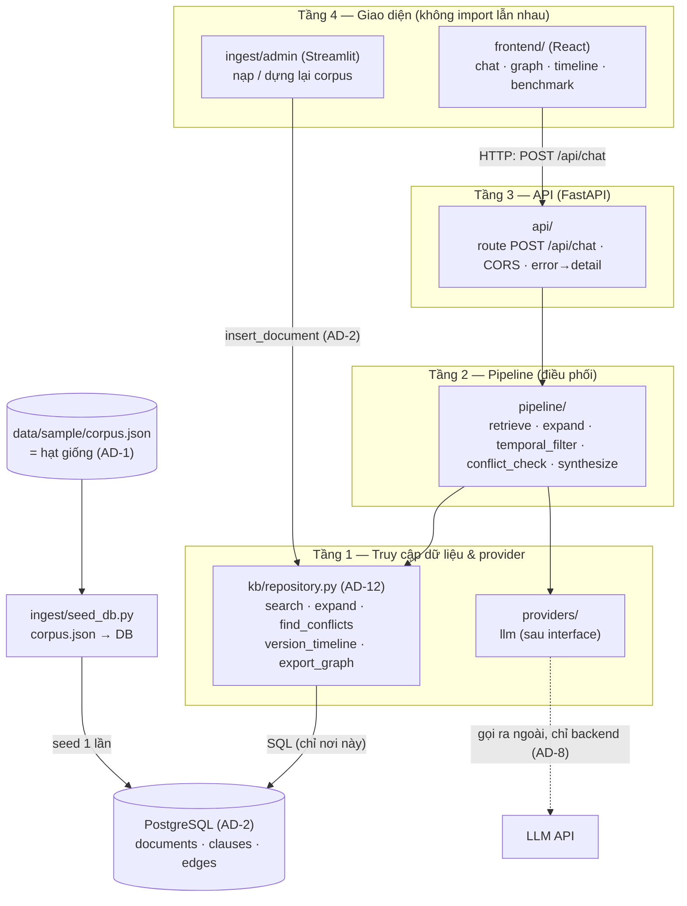
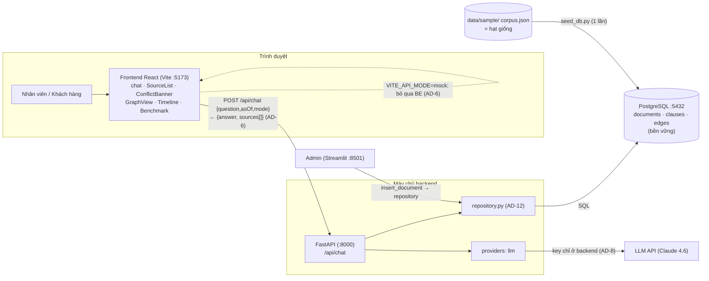
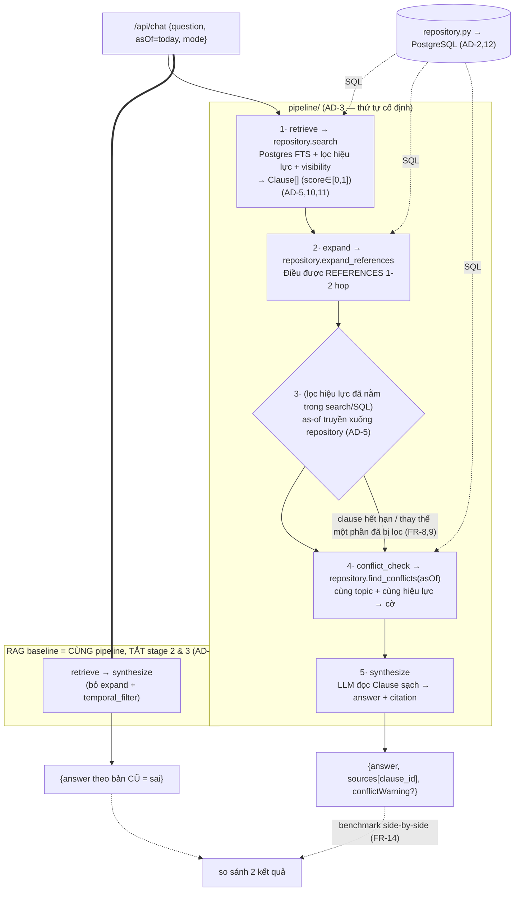
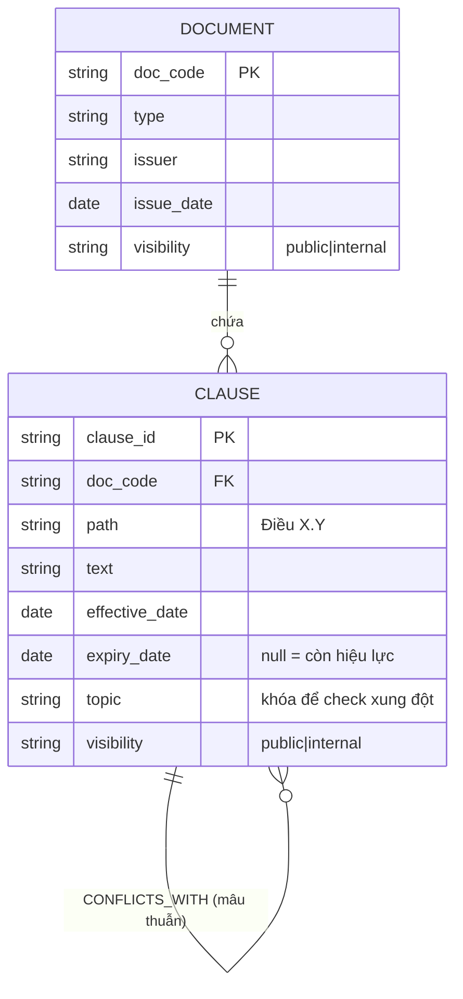
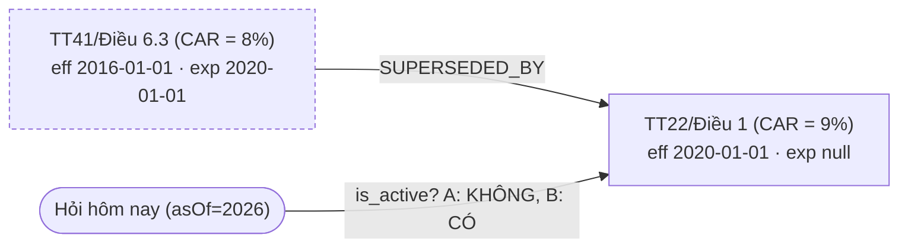

# Architecture Spine — Compliance Copilot

## Design Paradigm

**Lớp dữ liệu PostgreSQL sau một tầng repository + pipeline truy vấn tuyến tính, trên nền backend phân tầng.**

- **PostgreSQL là nguồn sự thật runtime:** dữ liệu pháp lý lưu bền vững trong Postgres (bảng `documents/clauses/edges`). `corpus.json` là **hạt giống** (seed) được annotate tay và versioned trong git; loader nạp seed vào DB. Restart không mất dữ liệu.
- **Repository là ranh giới truy cập DB duy nhất (seam):** mọi truy vấn (tìm kiếm, hiệu lực, quan hệ, xung đột) gói sau `kb/repository.py`; pipeline gọi hàm, không viết SQL. *(Do Epic 0 — người khác phụ trách — giao ra.)*
- **Pipes-and-filters:** mỗi câu hỏi đi qua chuỗi *stage* cố định; stage **điều phối** các hàm repository + gọi LLM. RAG baseline là *cùng pipeline* với vài stage tắt đi.
- **Layered backend:** `api → pipeline → repository → PostgreSQL`. Tầng dưới không bao giờ import tầng trên.

Ánh xạ tầng → thư mục: `api/` (HTTP), `pipeline/` (các stage điều phối), `kb/repository.py` (truy cập DB), `db/` (schema.sql, docker-compose), `providers/` (LLM), `ingest/` (seed corpus → DB).

## Invariants & Rules

### AD-1 — Một lược đồ dữ liệu duy nhất: corpus.json (seed) ↔ Postgres (runtime)
- **Binds:** all (Epic 0–7, BE + FE)
- **Prevents:** nhiều mô hình dữ liệu khác nhau; hai nơi cùng "sở hữu" dữ liệu.
- **Rule:** Có **một** lược đồ chuẩn `{documents, clauses, edges}`, thể hiện ở hai nơi khớp nhau: `data/sample/corpus.json` (**hạt giống**, hand-annotate, versioned) và các bảng Postgres (`backend/db/schema.sql`, **kho runtime**, seed từ corpus). Loader (Epic 0) là cầu nối. Frontend nhận dữ liệu trực quan qua `repository.export_graph()`, **không** đọc thẳng DB/corpus. Mọi `edges.from/to` là `clause_id`; `clause_id` do annotate tay sinh ra, là khóa duy nhất (loader không tự sinh id mới).

### AD-2 — PostgreSQL là kho lưu bền vững, truy vấn per-request
- **Binds:** backend (Epic 0–4, 6, 7)
- **Prevents:** mất dữ liệu khi restart; trạng thái không nhất quán.
- **Rule:** Dữ liệu sống trong **PostgreSQL** (bền vững trên đĩa). Mỗi request truy vấn DB (qua repository) — không có KnowledgeBase in-memory, không atomic-swap. Ingest văn bản mới (FR-3) và Radar (FR-16) = **INSERT/UPDATE vào Postgres** (bền vững ngay, restart vẫn còn). Kết nối dùng **connection pool** dùng chung, không mở kết nối tùy tiện mỗi request. *(Đảo ngược quyết định in-memory cũ — xem memlog.)*

### AD-3 — Truy vấn là pipeline stage cố định; baseline dùng chung pipeline
- **Binds:** Epic 2, 3, 4, 6 (FR-4,5,8,9,11,14,15)
- **Prevents:** các stage được viết với input/output lệ thuộc nhau không khớp; bước lọc hiệu lực bị bỏ qua tùy tiện; benchmark làm baseline yếu giả tạo.
- **Rule:** `/api/chat` đi qua đúng thứ tự: **retrieve** → **expand** (dẫn chiếu 1–2 hop) → **temporal_filter** (as-of) → **conflict_check** → **synthesize** (LLM + trích nguồn). Các stage **điều phối** hàm repository — `retrieve/expand/temporal/conflict` là **truy vấn SQL trong repository** (lọc hiệu lực + visibility nằm trong `repository.search`), pipeline chỉ truyền `asOf`/`mode` và ghép kết quả. `synthesize` gọi LLM. **RAG baseline = cùng pipeline với `expand` và lọc-hiệu-lực TẮT** qua trường request `mode: "system" | "baseline"` — không viết pipeline thứ hai (repository nhận cờ để bỏ lọc).
- **Làm rõ thứ tự conflict vs temporal:** xung đột tính trên tập **cùng còn hiệu lực** (`repository.find_conflicts(asOf)`). Xung đột = hai Clause *đều active* tại asOf, cùng `topic`, khác giá trị số. Trường hợp "bản cũ vs bản mới" KHÔNG phải xung đột — đó là *thay thế*, đã do lọc hiệu lực xử.

### AD-4 — Clause là đơn vị nguyên tử & neo trích dẫn
- **Binds:** all
- **Prevents:** lệch giữa "chunk" và "điều khoản"; trích dẫn không giải được về nguồn.
- **Rule:** Mọi thứ key theo `clause_id` ổn định (dạng `"TT41/Điều 6.3"`). Retrieve trả `clause_id`; trích nguồn tham chiếu `clause_id`; node đồ thị là `clause_id`. Một lược đồ ID, định nghĩa một lần (§Conventions).

### AD-5 — Hiệu lực = khoảng nửa mở, tính ở một chỗ duy nhất
- **Binds:** Epic 3, 4, 6 (FR-8,9,11,14)
- **Prevents:** mỗi dev tự viết logic "còn hiệu lực" khác nhau.
- **Rule:** Một Clause còn hiệu lực tại `asOf` **iff** `effective_date <= asOf AND (expiry_date IS NULL OR asOf < expiry_date)` (nửa mở; `expiry_date = null` nghĩa là **còn hiệu lực vô thời hạn**). Điều kiện này là **một mệnh đề `WHERE` viết ở một chỗ duy nhất trong repository** (SQL), mọi truy vấn dùng lại — không ai viết logic hiệu lực bên ngoài repository. Mặc định `asOf = hôm nay`. Thay thế một phần = set `expiry_date` ở cấp Clause.

### AD-6 — Contract API đóng băng theo API_CONTRACT.md [ADOPTED]
- **Binds:** ranh giới FE↔BE (FR-4)
- **Prevents:** FE và BE trôi khác nhau về hình dạng request/response.
- **Rule:** `POST /api/chat`: request `{question, asOf?, mode?}` (`asOf` mặc định hôm nay; `mode` ∈ `system|baseline`, mặc định `system`) → response `{answer, sources[], conflictWarning?, requestId?, latencyMs?}`, với **`sources[] = {clause_id, name, description}`** (thêm `clause_id` để FE click-through — FR-13). Thêm field phải **additive, tương thích ngược**. Lỗi trả HTTP đúng + trường `detail`. FE (kể cả mock mode) bám đúng contract này. **`docs/architecture/API_CONTRACT.md` được cập nhật khớp Rule này.**

### AD-7 — Hướng phụ thuộc & các ranh giới (repository + provider)
- **Binds:** backend
- **Prevents:** phụ thuộc vòng; SQL/LLM cắm thẳng khắp nơi.
- **Rule:** `api → pipeline → repository → PostgreSQL`; tầng dưới không import tầng trên. **Truy cập DB chỉ qua `kb/repository.py`** (xem AD-12) — `pipeline`/`api` không import psycopg, không viết SQL. LLM nằm sau **một interface provider** (`providers/llm.py`); đổi mock↔real chỉ ở một chỗ. MVP **không dùng embedding** (tìm kiếm bằng Postgres full-text, xem AD-10 + Deferred); nếu thêm dense về sau, embedding sau `providers/embedding.py`.

### AD-8 — Secret & lời gọi model chỉ ở backend [ADOPTED]
- **Binds:** all
- **Prevents:** rò API key ra frontend.
- **Rule:** Không key LLM/embedding nào ở frontend. Mọi lời gọi model đi qua backend. FE chỉ nói chuyện với `/api/*`.

### AD-9 — Ranh giới "chạy thật" vs "fallback demo"
- **Binds:** Epic 4, 7 + đường dự phòng demo
- **Prevents:** hardcode kết quả đội lốt logic thật; câu trả lời canned lẫn vào pipeline.
- **Rule:** Conflict (FR-11) và Radar (FR-16) **tính từ dữ liệu đồ thị lúc chạy**; "deterministic" = input được chuẩn bị chắc kích hoạt logic, KHÔNG phải output cài sẵn. Câu trả lời canned dự phòng nằm ở **một tầng fallback tách riêng**, không trộn vào các stage pipeline.

### AD-10 — Điểm & hợp nhất tìm kiếm chuẩn hóa
- **Binds:** retrieve (FR-5), benchmark (FR-14)
- **Prevents:** hai người trộn BM25/vector khác thang → ranking bất định, benchmark vô nghĩa.
- **Rule:** MVP dùng **Postgres full-text search** (`ts_rank` trên `tsvector` bỏ dấu tiếng Việt) — một thang duy nhất. `Candidate.score` luôn chuẩn hóa về `[0,1]`. Khi thêm dense về sau, hợp nhất bằng **RRF** rồi chuẩn hóa `[0,1]`. Toàn bộ ranking nằm ở **một chỗ**: `repository.search` — không stage nào khác chấm lại điểm.

### AD-11 — Lọc visibility ngay tại retrieve
- **Binds:** FR-7 (chế độ khách hàng)
- **Prevents:** clause `internal` lọt vào prompt LLM/`answer` khi phục vụ khách hàng.
- **Rule:** Ở `mode` công khai, lọc `visibility="public"` **là một mệnh đề `WHERE` trong `repository.search`** (không đợi tới synthesize); `expand`/`export_graph` cũng không vượt sang clause `internal` ở chế độ công khai. Kiểm được: mọi `sources` trả ở chế độ công khai đều `public`.

### AD-12 — Repository là ranh giới truy cập DB duy nhất (seam Epic 0 ↔ phần còn lại)
- **Binds:** all backend (Epic 0 giao ra; Epic 1–6 tiêu thụ)
- **Prevents:** SQL rải khắp pipeline; hai người viết truy vấn khác nhau; đội DB và đội app dẫm chân.
- **Rule:** Mọi truy cập dữ liệu đi qua `kb/repository.py` với interface hàm ổn định: `search(q, as_of, mode)`, `expand_references(ids)`, `find_conflicts(as_of)`, `version_timeline(clause_id)`, `export_graph()`, `insert_document(...)`. Trả về **dataclass `Clause`/`ConflictPair`** (khóa `clause_id`) — đây là **hợp đồng dữ liệu** giữa Epic 0 và Epic 1–6, khóa trước khi hai phía code song song. `pipeline`/`api` không được import psycopg hay viết SQL. Cho phép **repository stub** (dữ liệu cứng, đúng chữ ký) để phần app chạy song song khi DB chưa sẵn sàng.

### Sơ đồ hướng phụ thuộc (AD-7 — mũi tên = "được phép import"; không có mũi tên ngược)


> Quy tắc đọc: tầng dưới **không bao giờ** import tầng trên. `frontend` chỉ chạm `api` qua HTTP; **chỉ `repository` chạm Postgres** (không stage/api nào viết SQL).

## Consistency Conventions

| Concern | Convention |
| --- | --- |
| clause_id | `"{DOC_CODE}/Điều X[.Y[.Z]]"`, ví dụ `"TT41/Điều 6.3"`. DOC_CODE viết tắt ổn định (TT41, TT22...). |
| Cạnh đồ thị (edge types) | `AMENDS`, `SUPERSEDES` / `SUPERSEDED_BY`, `REFERENCES`, `GUIDES`, `CONFLICTS_WITH` — đúng tên, không đồng nghĩa. |
| Ngày tháng | ISO 8601 `YYYY-MM-DD`; `asOf` cùng định dạng. Khoảng hiệu lực nửa mở `[eff, exp)`. |
| Corpus JSON (seed) | `{ "documents": [...], "clauses": [...], "edges": [...] }`; mỗi clause có `topic` (snake_case). Là hạt giống → nạp vào Postgres. |
| DB (runtime) | Bảng `documents/clauses/edges` khớp corpus (`backend/db/schema.sql`); cột `metric_value/metric_unit` cho ngưỡng số; `tsvector` full-text bỏ dấu. |
| Repository contract | `kb/repository.py` trả `Clause`/`ConflictPair` dataclass (khóa `clause_id`). Chỉ nơi này viết SQL (AD-12). |
| Nhãn phạm vi | mỗi Document/Clause có `visibility: "public" | "internal"` (phục vụ FR-7). |
| Error shape | `{ "detail": "<message>" }`, HTTP 400/422/500/503. |
| Config | Frontend: `VITE_API_MODE`, `VITE_API_BASE_URL`. Backend: `DATABASE_URL`, LLM key qua biến môi trường, không commit. |
| Stage I/O | pipeline điều phối: nhận `Clause[]` từ repository, truyền `asOf`/`mode` xuống repository (không xử lý lại hiệu lực/visibility ở pipeline). |

## Stack

*(SEED — phiên bản đã tra web 7/2026; code sở hữu chi tiết sau khi tồn tại. Tìm kiếm bằng **Postgres full-text**; không embedding/vector store — xem Deferred.)*

| Name | Version |
| --- | --- |
| Python | 3.12 *(3.11 EOL 10/2026)* |
| **PostgreSQL** | **17** *(qua docker-compose)* |
| **psycopg** *(driver + pool)* | **3.x** |
| FastAPI | 0.139.2 |
| httpx *(gọi LLM API)* | 0.28.1 |
| React / TypeScript / Vite | 19 / ~6 / 8 *(đã pin trong repo)* |
| react-force-graph-2d *(trực quan đồ thị)* | 1.48.2 |
| Streamlit *(admin/ingest)* | 1.59.2 |
| LLM: Claude 4.6 (Sonnet/Opus) qua API | model mới nhất |

> Bỏ NetworkX + rank_bm25: quan hệ + tìm kiếm giờ do Postgres (edges table + full-text) lo. Traversal dẫn chiếu/timeline bằng SQL (join/recursive CTE) trong repository.

## Structural Seed

### Container view (ai chạy ở đâu, nói chuyện với ai)



### Data flow — pipeline truy vấn (AD-3; mỗi stage: `List[Candidate] → List[Candidate]`)


> Điểm mấu chốt: stage **3· temporal_filter** là chỗ hệ thống hơn baseline. Baseline không viết lại — chỉ tắt stage 2 và 3.

### Core entities (ERD — tên + quan hệ, không phải chi tiết cột)



### Ví dụ chuỗi phiên bản (AD-5 — cách "thay thế" biểu diễn theo thời gian)


> Trả lời dùng **B (9%)**, cảnh báo A đã bị thay thế. Baseline không lọc → có thể trả A (8%, sai).

### Source tree (scaffold, code sở hữu chi tiết)

```text
backend/
  api/         # FastAPI app, route /api/chat, CORS, error->detail (AD-6, AD-8)
  pipeline/    # retrieve, expand, temporal, conflict, synthesize — điều phối repository (AD-3)
  kb/          # repository.py = ranh giới DB (AD-12); Clause/ConflictPair dataclass
  db/          # schema.sql, docker-compose.yml (Postgres) — Epic 0
  providers/   # llm.py sau interface (AD-7, AD-8)
  ingest/      # seed_db.py: corpus.json -> Postgres (AD-1); app.py (Streamlit admin)
data/
  sample/      # corpus.json + corpus.schema.json (AD-1) — hạt giống
frontend/
  src/
    services/  # chatApi.ts (giữ contract, mock/real) (AD-6)
    components/ # Chat, SourceList, ConflictBanner, GraphView, Timeline, Benchmark (Epic 5)
```

## Deployment & Runtime (envelope demo)

Bốn tiến trình cục bộ khi demo:

| Tiến trình | Cổng | Lệnh (định hướng) | Vai trò |
| --- | --- | --- | --- |
| **PostgreSQL** | 5432 | `cd backend/db && docker compose up -d` | Kho dữ liệu; schema tạo tự động (AD-2) |
| Backend (FastAPI) | 8000 | `uvicorn api.main:app` | `/api/chat`; `DATABASE_URL` + key LLM qua env (AD-8) |
| Frontend (Vite) | 5173 | `npm run dev` | Giao diện; `VITE_API_MODE=real`, `VITE_API_BASE_URL=http://localhost:8000` |
| Admin (Streamlit) | 8501 | `streamlit run ingest/app.py` | Nạp văn bản → `repository.insert_document` (bền vững) |

- **Seed dữ liệu:** `python backend/ingest/seed_db.py` nạp `corpus.json` → Postgres (idempotent). Backend không seed; chỉ query.
- **Thứ tự bật:** Postgres → seed → backend → frontend; Streamlit độc lập.
- **Fallback demo (AD-9):** `VITE_API_MODE=mock` + bộ câu trả lời canned cho các câu demo chính, ở tầng FE tách riêng — bật khi LLM API lag/lỗi giữa pitch, không trộn vào pipeline.
- **Secrets:** key LLM chỉ trong `.env` backend (đã gitignore); không commit, không đưa ra FE.

## Capability → Architecture Map

| Epic / FR | Lives in | Governed by |
| --- | --- | --- |
| **Epic 0 database (FR-1,2 + hạ tầng)** | `db/`, `ingest/seed_db.py`, `kb/repository.py` | AD-1, AD-2, AD-5, AD-10, AD-11, AD-12 |
| Epic 1 chatbot + retrieve (FR-1..9,13) | `api/`, `pipeline/`, `providers/`, gọi `repository` | AD-3, AD-6, AD-7, AD-8, AD-12 |
| Epic 2 đồ thị + timeline (FR-10,12) | `frontend/` ← `repository.export_graph/version_timeline` | AD-1, AD-4, AD-12 |
| Epic 3 conflict (FR-11) | `pipeline/conflict_check` ← `repository.find_conflicts` | AD-3, AD-5, AD-9, AD-12 |
| Epic 4 benchmark (FR-14,15) | `pipeline` (cờ baseline) + FE benchmark | AD-3 |
| Epic 5 admin (FR-3) | `ingest/app.py` ← `repository.insert_document` | AD-2, AD-12 |
| Epic 6 radar (FR-16, stretch) | `repository` traversal + báo cáo | AD-2, AD-9, AD-12 |

## Deferred

- **Citation parser tự động** (regex nhận diện dẫn chiếu) — hand-annotate đủ cho 48h; parser là v2.
- **LLM judge cho xung đột** — rule quét đủ cho MVP.
- **Máy Dò Lệch Chuẩn & Văn bản Hợp nhất Sống** — hướng mở rộng v2.
- **Graph DB (Neo4j) / Vector DB server (Qdrant)** — vẫn không dùng; quan hệ do Postgres (`edges` + recursive CTE) lo. Cân nhắc khi corpus rất lớn / cần graph-native.
- **Phân quyền/auth doanh nghiệp** — chỉ giữ nguyên tắc AD-8; RBAC đầy đủ để sau.
- **Dense embedding + vector store** — MVP **BM25-only** (AD-10). Khi thêm ([Đầy đủ] của FR-5): e5/bge-m3 **KHÔNG phải API sẵn** như LLM — phải dùng embedding API thật (OpenAI/Voyage) hoặc chạy local (sentence-transformers), rồi ChromaDB nhúng/numpy cosine sau interface AD-7.
